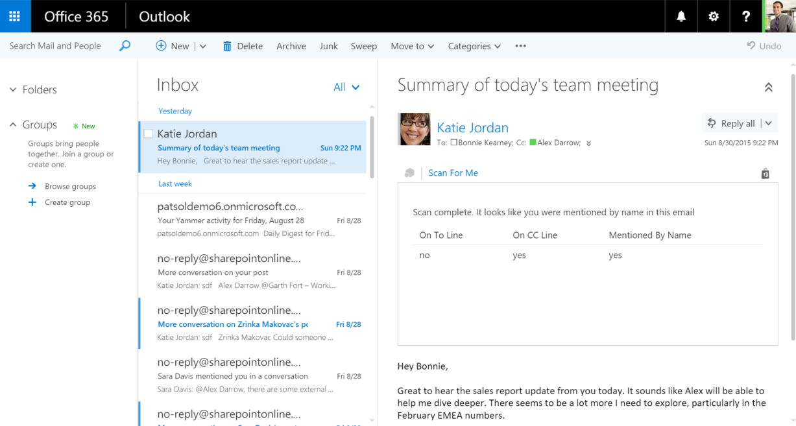

# <a name="outlook-add-in-a-mail-add-in-for-a-read-scenario-that-checks-whether-the-user-is-mentioned-on-the-to-line-cc-line-or-body-of-an-email"></a>Outlook アドイン:読み取りシナリオ用のメール アドイン。ユーザーが電子メールの宛先行、CC 行、または本文のいずれに記載されているかを確認します。

**目次**

* [概要](#summary)
* [前提条件](#prerequisites)
* [サンプルの主要なコンポーネント](#components)
* [コードの説明](#codedescription)
* [ビルドとデバッグ](#build)
* [トラブルシューティング](#troubleshooting)
* [質問とコメント](#questions)
* [投稿](#contribute)
* [その他のリソース](#additional-resources)

<a name="summary"></a>
##<a name="summary"></a>概要

このサンプルでは、[JavaScript API for Office](https://msdn.microsoft.com/library/b27e70c3-d87d-4d27-85e0-103996273298(v=office.15)) を使用して、ハイパーリンクを参照する電子メールの本文を解析する Outlook アドインの作成方法を示します。次に、質問のシナリオの画像を示します。

 

<a name="prerequisites"></a>
##<a name="prerequisites"></a>前提条件
このサンプルを実行するには次のものが必要です。  

  - Visual Studio 2015。  
  - 少なくとも 1 つの電子メール アカウントまたは Office 365 アカウントがある Exchange 2013 を実行するコンピューター。[Office 365 Developer サブスクリプション](https://aka.ms/devprogramsignup)にサインアップし、そこから Office 365 アカウントを取得することができます。
  - Internet Explorer 9 以降。インストールが必要ですが、既定のブラウザーである必要はありません。Office アドインをサポートするために、ホストとして機能する Office クライアントは Internet Explorer 9 以上を構成しているブラウザー コンポーネントを使用します。
  - 既定のブラウザーとして次のいずれか:Edge、Internet Explorer 9、Safari 5.0.6、Firefox 5、Chrome 13、これらのブラウザーのいずれかの最新バージョン。
  - JavaScript プログラミングと Web サービスに精通していること。

<a name="components"></a>
##<a name="key-components"></a>主要なコンポーネント

このソリューションは、[Visual Studio](https://msdn.microsoft.com/library/office/fp179827.aspx#Tools_CreatingWithVS) で作成されました。ScanForMe と ScanForMeWeb の 2 つのプロジェクトで構成されています。以下に、それらのプロジェクト内のキー ファイルの一覧を示します。 
#### <a name="scanforme-project"></a>ScanForMe プロジェクト

* [```ScanForMe.xml```](/ScanForMe/ScanForMeManifest/ScanForMe.xml) Outlook アドインの[マニフェスト ファイル](https://dev.office.com/docs/add-ins/outlook/manifests/manifests)。

#### <a name="scanformeweb-project"></a>ScanForMeWeb プロジェクト

* [```ItemRead.html```](/ScanForMeWeb/ItemRead.html) Outlook アドインの HTML ユーザー インターフェイス。
* [```ItemRead.js```](/ScanForMeWeb/ItemRead.js) Office API の JavaScript を使用して Word と対話するために Home.html によって使用される JavaScript コード。 


<a name="codedescription"></a>
##<a name="description-of-the-code"></a>コードの説明

このサンプルのコア ロジックは、ScanForMeWeb プロジェクトの [```ItemRead.js```](/ScanForMeWeb/ItemRead.js) ファイルです。 

アドインを初期化すると、ユーザーの電子メール アドレスが存在するかどうか、`item.to` と `item.cc` プロパティをスキャンします。ユーザーの電子メール アドレスは、[```Office.context.mailbox.userProfile```](https://dev.office.com/reference/add-ins/outlook/Office.context.mailbox.userProfile) プロパティから取得します。ユーザーがこの電子メールの宛先行または CC 行で検出された場合、それらはアドインの UI に登録されます。 

Body オブジェクトの [```getAsync()```](http://dev.office.com/reference/add-ins/outlook/Body) メソッドは、テキスト形式の電子メールの本文を取得するために使用されます。この非同期操作が完了すると、インライン コールバック関数が呼び出されます。この関数は正規表現を使用して、ユーザーの名が使用されていないか電子メール本文のテキストをスキャンします。1 回以上使用されていることが検出された場合、アドインの UI に、ユーザーの名前が電子メールの本文に記載されていることが示されます。 

>注:HTML 形式の電子メールの本文を取得する getAsync を使用する例については、[Outlook-Add-in-LinkRevealer](https://github.com/OfficeDev/Outlook-Add-in-LinkRevealer) のサンプルを参照してください。 


<a name="build"></a>
##<a name="build-and-debug"></a>ビルドとデバッグ
1. [```ScanForMe.sln```](ScanForMe.sln) ファイルを Visual Studio で開きます。
2. F5 キーを押して、サンプル アドインをビルドおよび展開します。 
3. Outlook が起動したら、受信トレイから電子メールを選択します。
4. アドイン アプリ バーからアドインを選択して、起動します。

<a name="questions"></a>
## <a name="questions-and-comments"></a>質問とコメント

- このサンプルの実行について問題がある場合は、[問題をログに記録](https://github.com/OfficeDev/Outlook-Add-in-ScanForMe/issues)してください。
- Office アドイン開発全般の質問については、「[スタック オーバーフロー](http://stackoverflow.com/questions/tagged/office-addins)」に投稿してください。質問またはコメントには、必ず [office-addins] のタグを付けてください。


<a name="contribute"></a>
## <a name="contributing"></a>投稿 ##
当社のサンプルに是非投稿してください。投稿方法のガイドラインについては、[投稿ガイド](./Contributing.md)を参照してください。

このプロジェクトでは、[Microsoft Open Source Code of Conduct](https://opensource.microsoft.com/codeofconduct/) が採用されています。詳細については、「[規範に関する FAQ](https://opensource.microsoft.com/codeofconduct/faq/)」を参照してください。または、その他の質問やコメントがあれば、[opencode@microsoft.com](mailto:opencode@microsoft.com) までにお問い合わせください。


<a name="additional-resources"></a>
## <a name="additional-resources"></a>その他のリソース ##

- [その他のアドインのサンプル](https://github.com/OfficeDev?utf8=%E2%9C%93&query=-Add-in)
- [Office アドイン](https://dev.office.com/reference/add-ins)
- [アドインの構造](https://dev.office.com/docs/add-ins/overview/office-add-ins#StartBuildingApps_AnatomyofApp)
- [Visual Studio で Office アドインを作成する](https://dev.office.com/docs/add-ins/get-started/create-and-debug-office-add-ins-in-visual-studio)


## <a name="copyright"></a>著作権
Copyright (c) 2015 Microsoft.All rights reserved.
