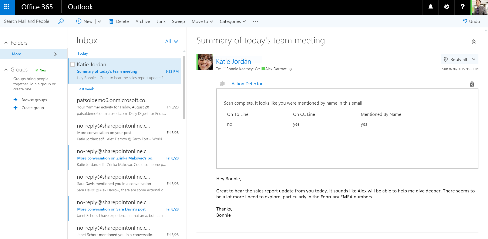

# <a name="outlook-add-in-a-mail-add-in-for-a-read-scenario-that-checks-whether-the-user-is-mentioned-on-the-to-line-cc-line-or-body-of-an-email"></a>Надстройка Outlook: почтовая надстройка для сценария чтения, которая проверяет, упоминается ли пользователь в строке "Кому", строке "Копия" или тексте сообщения.

**Содержание**

* [Сводка](#summary)
* [Необходимые компоненты](#prerequisites)
* [Ключевые компоненты примера](#components)
* [Описание кода](#codedescription)
* [Сборка и отладка](#build)
* [Устранение неполадок](#troubleshooting)
* [Вопросы и комментарии](#questions)
* [Участие](#contribute)
* [Дополнительные ресурсы](#additional-resources)

<a name="summary"></a>
##<a name="summary"></a>Сводка

В этом примере показано, как с помощью [API JavaScript для Office](https://msdn.microsoft.com/library/b27e70c3-d87d-4d27-85e0-103996273298(v=office.15)) создать надстройку Outlook, анализирующую текст сообщения на предмет ссылок. На приведенном ниже изображении показан рассматриваемый сценарий.

 

<a name="prerequisites"></a>
##<a name="prerequisites"></a>Необходимые компоненты
Для этого примера требуются следующие компоненты:  

  - Visual Studio 2015.  
  - Компьютер с Exchange 2013 и по крайней мере одной учетной записью электронной почты или учетной записью Office 365. Вы можете получить [подписку разработчика приложений для Office 365](https://aka.ms/devprogramsignup) и, следовательно, соответствующую учетную запись Office 365.
  - Браузер Internet Explorer 9 или более поздняя версия. Этот браузер должен быть установлен, но может не являться браузером по умолчанию. Для поддержки Надстройки Office клиент Office, действующий как ведущее приложение, задействует компоненты браузера, которые являются частью Internet Explorer 9 и более поздних версий.
  - По умолчанию используется один из следующих браузеров: Edge, Internet Explorer 9, Safari 5.0.6, Firefox 5, Chrome 13 или более поздние версии этих браузеров.
  - Опыт программирования на JavaScript и работы с веб-службами.

<a name="components"></a>
##<a name="key-components"></a>Ключевые компоненты

Это решение было создано в [Visual Studio](https://msdn.microsoft.com/library/office/fp179827.aspx#Tools_CreatingWithVS). Оно состоит из двух проектов — ScanForMe и ScanForMeWeb. Ниже представлен список основных файлов в этих проектах. 
#### <a name="scanforme-project"></a>Проект ScanForMe

* [```ScanForMe.xml```](/ScanForMe/ScanForMeManifest/ScanForMe.xml). [Файл манифеста](https://dev.office.com/docs/add-ins/outlook/manifests/manifests) для надстройки Outlook.

#### <a name="scanformeweb-project"></a>Проект ScanForMeWeb

* [```ItemRead.html```](/ScanForMeWeb/ItemRead.html). Пользовательский интерфейс на HTML для надстройки Outlook.
* [```ItemRead.js```](/ScanForMeWeb/ItemRead.js). Код JavaScript, используемый на странице Home.html для взаимодействия с Word при помощи API JavaScript для Office. 


<a name="codedescription"></a>
##<a name="description-of-the-code"></a>Описание кода

Базовая логика этого примера находится в файле [```ItemRead.js```](/ScanForMeWeb/ItemRead.js)  проекта ScanForMeWeb. 

После инициализации надстройки свойства `item.to` и `item.cc` проверяются на наличие электронного адреса пользователя. Этот адрес можно получить с помощью свойства [```Office.context.mailbox.userProfile```](https://dev.office.com/reference/add-ins/outlook/Office.context.mailbox.userProfile). Если пользователь найден в строке "Кому" или "Копия", этот факт отмечается в пользовательском интерфейсе надстройки. 

Затем с помощью метода [```getAsync()```](http://dev.office.com/reference/add-ins/outlook/Body) объекта Body можно получить текст сообщения в формате Text. По завершении этой асинхронной операции вызывается встроенная функция обратного вызова. Эта функция использует регулярное выражение, чтобы проверить, встречается ли в тексте сообщения имя пользователя. Если оно встречается один или несколько раз, в пользовательском интерфейсе надстройки это отмечается. 

>Примечание. Получение текста сообщения в формате HTML с помощью метода getAsync показано в примере [Outlook-Add-in-LinkRevealer](https://github.com/OfficeDev/Outlook-Add-in-LinkRevealer). 


<a name="build"></a>
##<a name="build-and-debug"></a>Сборка и отладка
1. Откройте файл [```ScanForMe.sln```](ScanForMe.sln) в Visual Studio.
2. Нажмите клавишу F5, чтобы собрать и развернуть пример надстройки. 
3. После запуска Outlook выберите сообщение в папке "Входящие".
4. Запустите надстройку, выбрав ее на панели приложения.

<a name="questions"></a>
## <a name="questions-and-comments"></a>Вопросы и комментарии

- Если у вас возникнут проблемы с запуском этого примера, [сообщите о них](https://github.com/OfficeDev/Outlook-Add-in-ScanForMe/issues).
- Общие вопросы о разработке надстроек Office следует задавать на сайте [Stack Overflow](http://stackoverflow.com/questions/tagged/office-addins). Помечайте свои вопросы и комментарии тегом [office-addins].


<a name="contribute"></a>
## <a name="contributing"></a>Участие ##
Мы приветствуем ваше участие в создании примеров. В [руководстве по участию](./Contributing.md) описано, с чего начать.

Этот проект соответствует [правилам поведения Майкрософт, касающимся обращения с открытым кодом](https://opensource.microsoft.com/codeofconduct/). Читайте дополнительные сведения в [разделе вопросов и ответов по правилам поведения](https://opensource.microsoft.com/codeofconduct/faq/) или отправляйте новые вопросы и замечания по адресу [opencode@microsoft.com](mailto:opencode@microsoft.com).


<a name="additional-resources"></a>
## <a name="additional-resources"></a>Дополнительные ресурсы ##

- [Дополнительные примеры надстроек](https://github.com/OfficeDev?utf8=%E2%9C%93&query=-Add-in)
- [Надстройки Office](https://dev.office.com/reference/add-ins)
- [Структура надстройки](https://dev.office.com/docs/add-ins/overview/office-add-ins#StartBuildingApps_AnatomyofApp)
- [Создание надстройки Office в Visual Studio](https://dev.office.com/docs/add-ins/get-started/create-and-debug-office-add-ins-in-visual-studio)


## <a name="copyright"></a>Авторское право
(c) Корпорация Майкрософт (Microsoft Corporation), 2015. Все права защищены.